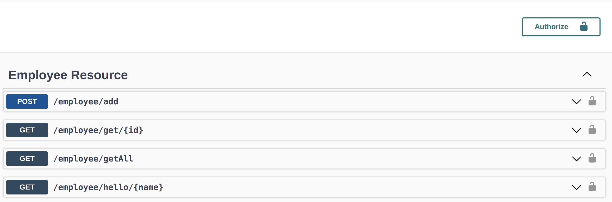
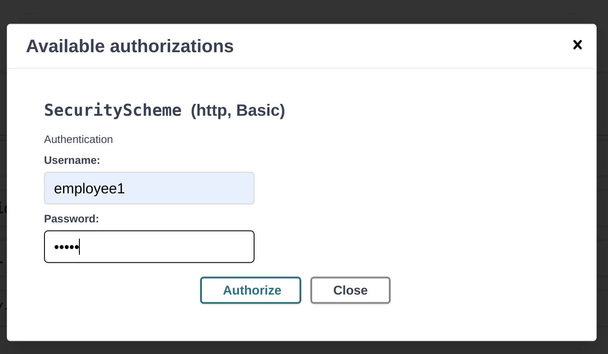

= Security mit JPA
Hartl Anna - erstellt am 12.1.2022
//:toc-placement!:  // prevents the generation of the doc at this position, so it can be printed afterwards
:sourcedir: ../src/main/java
:icons: font
:sectnums:    // Nummerierung der Überschriften / section numbering
:toc: left
//Need this blank line after ifdef, don't know why...
ifdef::backend-html5[]

include::https://2122-4ahif-nvs.github.io/01-microproject-AnnaHartl/security-jpa-detail.html[Detail Dokumentation]

== Dependecy hinzufügen

== User Klasse erstellt

== Öffentliche Klasse mit Endpoints
Öffentlich in dem Sinne das jeder zugreifen kann.
----
@PermitAll
@Path("/product")
public class ProductResource {}
----

== Employee Endpoint Klasse nur für User mit Rollen "employee" und "admin"
----
@RolesAllowed("employee")
@Path("/employee")
public class EmployeeResource {}
----

== Im Init Bean die Rollen zugewiesen

.test
NOTE: http://localhost:8080/product/getAll => kann Problemlos darauf zu greifen
http://localhost:8080/employee/getAll => man wird nach Username und password gefragt

Leichter geht die Abfrage mit Swagger

Nach dem Login kann man alle Abfragen ausführen